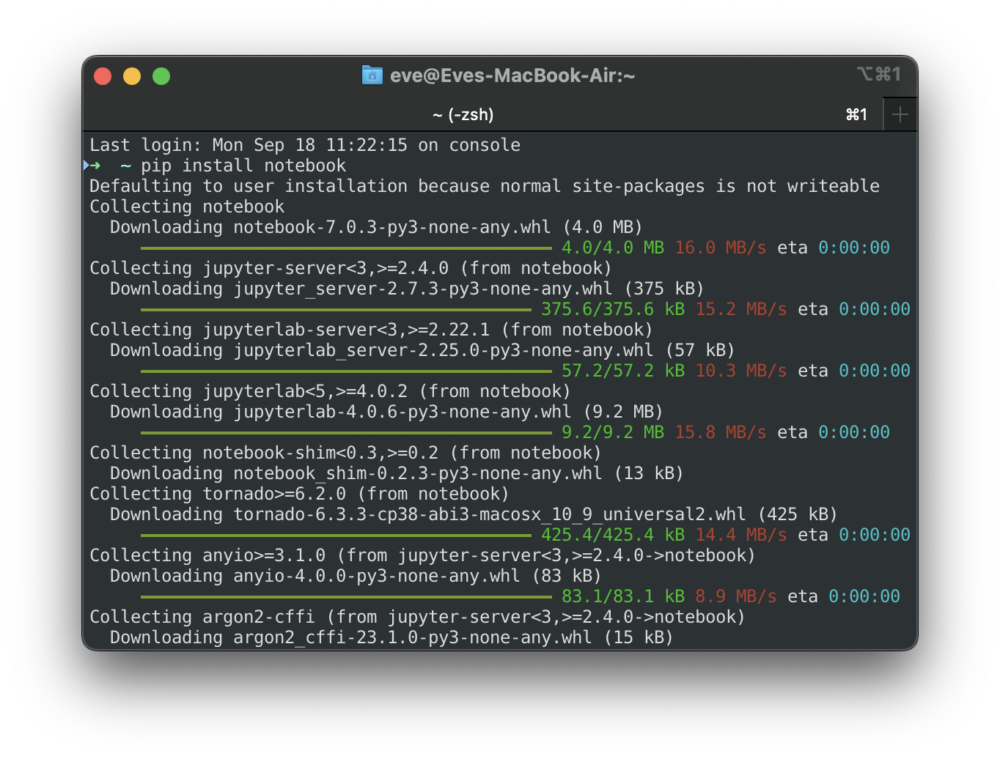
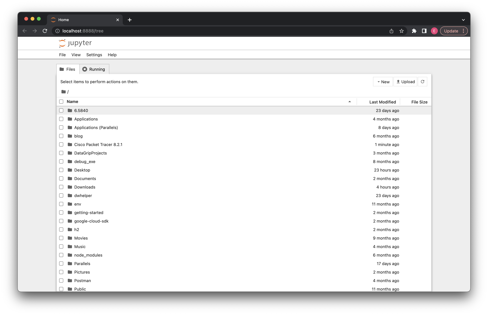

# Lab 1

## Download Jupyter Notebook

Install the classic Jupyter Notebook with:

```
pip install notebook
```



To run the notebook:

```
jupyter notebook
```




## Download in Anaconda

# How to Change Python Version in Anaconda

### Create a New Environment

```python
conda create -n env_name python=version_number
```


```
conda create -n qiskit_learning
```

```
conda activate qiskit_learning
```

```
pip install qiskit
```

```
pip install 'qiskit[visualization]'
```

```
pip show qiskit
```

```
pip show matplotlib 
```


