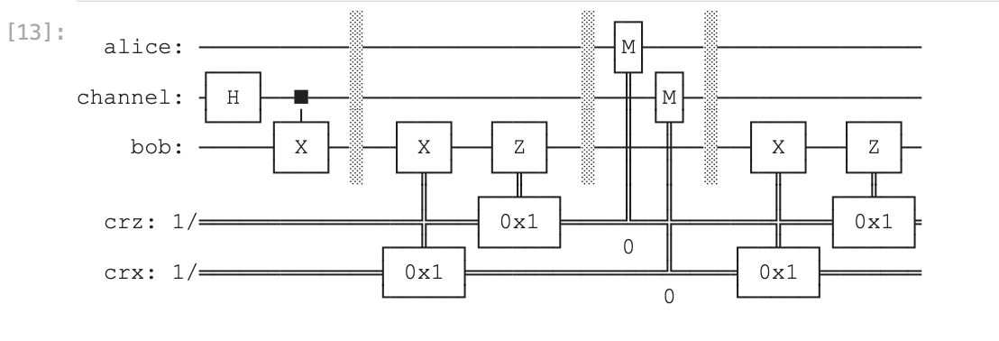
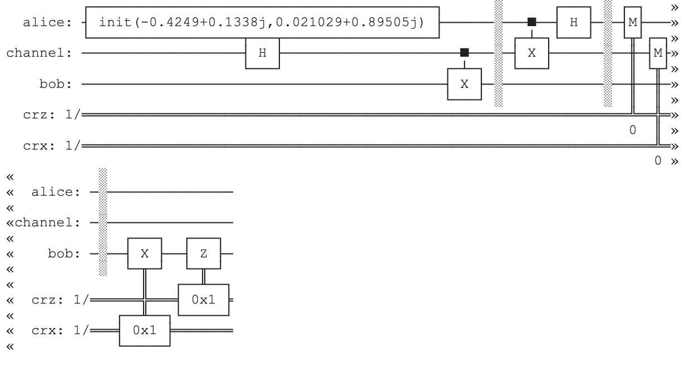
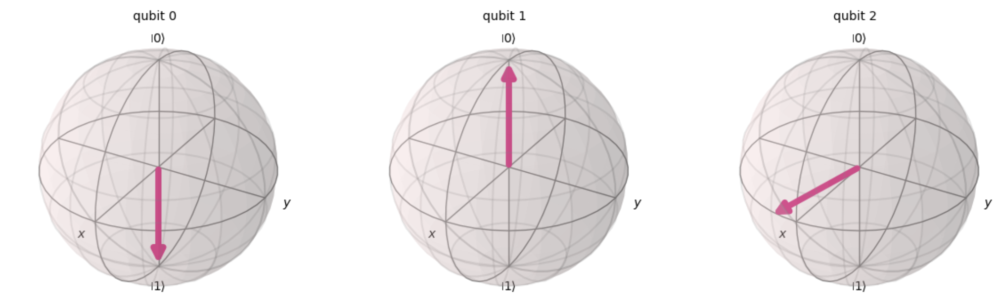
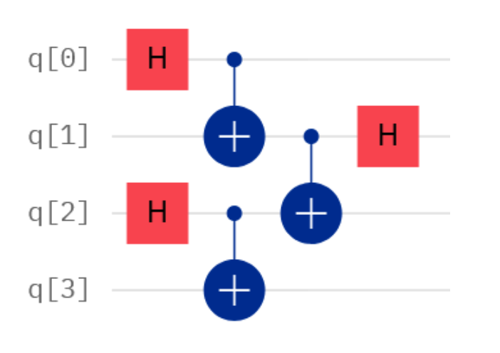
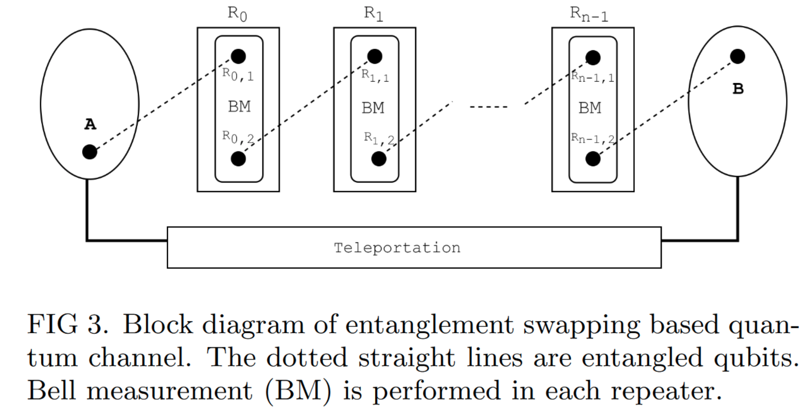

# HW 4: Quantum Gate Teleportation

```python
import numpy as np
import matplotlib.pyplot as plt
from qiskit import QuantumCircuit, QuantumRegister, ClassicalRegister, Aer, execute, transpile, assemble
from qiskit.visualization import plot_histogram, plot_bloch_multivector, array_to_latex
from qiskit.extensions import Initialize
from qiskit.quantum_info import random_statevector, Statevector
```

```python
def create_bell_pair(qc, a, b):   
    """Creates a Bell pair using qubits a & b."""
    qc.h(a) # Put qubit a into state |+>.
    qc.cx(a,b) # CNOT with a as control and b as target.
```


##  Step 1: Create a channel to Bob.

```python
# Step 1: The protocol uses 3 qubits and 2 classical bits in 2 different registers.
qr1 = QuantumRegister(1, name="alice") # 创建一个名为 "alice" 的量子寄存器，包含1个量子比特
qr2 = QuantumRegister(1, name="channel") # 创建一个名为 "channel" 的量子寄存器，包含1个量子比特
qr3 = QuantumRegister(1, name="bob") # 创建一个名为 "bob" 的量子寄存器，包含1个量子比特
crz = ClassicalRegister(1, name="crz") # 创建一个名为 "crz" 的经典寄存器，包含1个经典比特
crx = ClassicalRegister(1, name="crx") # 创建一个名为 "crx" 的经典寄存器，包含1个经典比特

teleportation_circuit = QuantumCircuit(qr1, qr2, qr3, crz, crx)
# 创建一个量子电路，包含上述的量子和经典寄存器

# Set up a Bell pair between the channel qubit and Bob's qubit.
create_bell_pair(teleportation_circuit, 1, 2)
# 调用 create_bell_pair 函数，在量子电路中创建一个贝尔对。这里使用的是 "channel" 和 "bob" 寄存器中的量子比特（在整个电路中分别是第2和第3个量子比特，因为计数是从0开始的）

# View the circuit so far.
teleportation_circuit.draw()
# 这一行代码用于可视化目前为止设置的量子电路。它将显示包含一个贝尔对的初步电路结构。
```


## Step 2: Alice connects her qubit to the shared channel.

Alice applies a CNOT, controlled by her qubit in state $\psi$, to her share of the entangled Bell state channel. She then puts her qubit into the Hadamard basis, resulting in what is known as the Bell measurement. Bob will have a version of Alice's qubit when she measures in the Hadamard basis, but Bob's result will require correction.  (That correction will happen in the next steps.)

> Alice将一个CNOT应用到纠缠贝尔态信道中，该CNOT由其状态$\psi$中的量子比特控制。然后，她将她的量子比特放入哈达玛基，得到了所谓的贝尔测量。当Alice以哈达玛基测量时，Bob将得到Alice的量子比特，但Bob的结果需要修正。(这种修正将在接下来的步骤中发生。)

```python
def alice_gates(qc, psi, a):
    qc.cx(psi, a)
    qc.h(psi)
    
#  qc.cx(psi, a) 爱丽丝对她的量子比特（标记为 psi）和她所拥有的贝尔对中的一个量子比特（标记为 a）执行一个CNOT门。这里 psi 是要传输的量子状态，而 a 是与 "channel" 寄存器中的量子比特纠缠的量子比特。
# qc.h(psi): 接着，爱丽丝对她的量子比特（psi）应用一个Hadamard门。
# Hadamard门将 psi 的状态转换到Hadamard基础，这是进行贝尔测量的一部分。

# 贝尔测量 (Bell Measurement)
# 这些操作的组合称为贝尔测量，是量子隐形传态的关键步骤。通过贝尔测量，爱丽丝的量子比特和她所拥有的贝尔对之一的量子比特之间的关系被编码并准备传输
```

```python
# Step 2.
teleportation_circuit.barrier() # Use a barrier (visual only) to separate steps.
# teleportation_circuit.barrier(): 在电路中添加一个障碍（仅用于可视化），以便在视觉上区分不同的操作步骤。
alice_gates(teleportation_circuit, 0, 1)
# alice_gates(teleportation_circuit, 0, 1): 将爱丽丝的操作添加到电路中。这里 0 代表 psi（Alice的量子比特），1 代表与 "channel" 寄存器中的量子比特纠缠的 a。
teleportation_circuit.draw() # 显示添加了爱丽丝操作后的量子电路
```


> 在这些步骤之后，爱丽丝将对她的量子比特进行测量，并将测量结果（两个经典比特）发送给鲍勃（Bob）。鲍勃将根据这些测量结果对他的量子比特进行修正，以恢复原始的 `psi` 状态。
>
> 这段代码是量子隐形传态协议的关键部分，涉及量子纠缠、量子态的编码和传输，以及量子测量。通过这些操作，量子信息能够在不同的量子比特之间“传输”，尽管实际上没有物理信息在移动


## Step 3: Prepare for state correction: get the classical bits needed to correct.

```python
def measure_and_send(qc, a, b):
    # Measures qubits a & b and 'sends' the results to Bob.
    qc.barrier() # 在量子电路中添加一个障碍，以便在视觉上区分不同的操作步骤。
    qc.measure(a,0) 
    # qc.measure(a,0): 测量爱丽丝（Alice）的量子比特（a，即 psi），并将测量结果存储在第一个经典比特中（crz 寄存器的比特）
    qc.measure(b,1)
    # 测量与爱丽丝的量子比特纠缠的那个量子比特（b，即与 "channel" 寄存器中的量子比特纠缠的那个），并将测量结果存储在第二个经典比特中（crx 寄存器的比特）
```

```python
# Step 3
measure_and_send(teleportation_circuit, 0, 1)
# 将测量步骤添加到量子电路中。在这里，0 和 1 分别代表两个需要测量的量子比特
teleportation_circuit.draw()
# 显示添加了测量步骤后的量子电路
```


> **测量结果的作用**
>
> - 这些测量结果（存储在经典比特中）是必需的，因为它们将用于指导鲍勃如何校正他的量子比特，以恢复原始的量子态 `psi`。
> - 爱丽丝将这两个经典比特的信息“发送”给鲍勃。虽然这里的“发送”是在量子电路中模拟的，但在实际应用中，这会涉及到经典通信渠道。
>
> 在隐形传态的最后一步中，鲍勃将根据这两个经典比特的值对他的量子比特进行相应的校正操作，完成整个隐形传态过程。这些操作确保了尽管爱丽丝的量子比特已被测量和改变，鲍勃的量子比特将被调整为与原始的 `psi` 状态相同的状态


## Step 4: Correct using classical bits.

The channel measurement is used to correct bit flips, while Alice's measurement in the Hadamard basis is used to correct the phase flips; together, these get $\psi$ accurately to Bob.

```python
def bob_gates(qc, qubit, crz, crx):
    qc.x(qubit).c_if(crx, 1) # Apply gates if the registers are in the state '1'.
    # 如果 crx 寄存器中的比特值为 1，则对鲍勃的量子比特（qubit）应用一个X门（量子比特翻转门）。这是对位翻转（bit flip）错误的校正
    qc.z(qubit).c_if(crz, 1)
    # 如果 crz 寄存器中的比特值为 1，则对鲍勃的量子比特应用一个Z门（相位翻转门）。这是对相位翻转（phase flip）错误的校正
```

```python
# Step 4
teleportation_circuit.barrier() 
bob_gates(teleportation_circuit, 2, crz, crx) 
#  将鲍勃的校正步骤添加到量子电路中 在这里，2 代表鲍勃的量子比特，crz 和 crx 是之前爱丽丝测量后得到的经典比特
teleportation_circuit.draw()
```



> 量子隐形传态过程的第四步，即根据从爱丽丝（Alice）处接收到的经典比特信息来对鲍勃（Bob）的量子比特进行校正。这个步骤是量子隐形传态的最后阶段，确保了鲍勃的量子比特最终将与爱丽丝最初的量子态 *ψ* 相同。
>
> 


> **校正操作的意义**
>
> 根据爱丽丝的测量结果，鲍勃使用这些条件性操作来校正他的量子比特状态。这些操作确保他的量子比特最终将与爱丽丝的初始量子态 *ψ* 相同，即使 *ψ* 的确切状态在整个过程中从未通过经典或量子通道直接传输。
>
> 通过这四个步骤，量子隐形传态协议允许一个量子态在不直接传输实际的量子比特的情况下从一个地点传输到另一个地点。这是量子信息科学中一个非常重要且引人入胜的概念，显示了量子纠缠和量子通信的独特能力。


## Step 5: Test by sending an arbitrary state belonging to Alice, $\psi$, to Bob.

> 量子隐形传态过程的第五步，即通过传输一个随机生成的量子态 *ψ* 来测试整个量子隐形传态电路的有效性。这个步骤验证了量子电路是否能够准确地将爱丽丝（Alice）的量子态传输到鲍勃（Bob）那里

```python
psi = random_statevector(2) # 生成一个随机的二维量子态ψ
init_gate = Initialize(psi) # 创建一个初始化门 init_gate，用于将爱丽丝的量子比特设置为态ψ
init_gate.label = "init"
```

```python
# Display it nicely.
display(array_to_latex(psi, prefix="|\\psi\\rangle ="))
# Show it on a Bloch sphere.
plot_bloch_multivector(psi) # 在布洛赫球上可视化量子态. 布洛赫球是一个用于表示量子比特状态的球形模型。
```

result:


```python
# Create a circuit to hold this initial state and append it to the front of a teleportation circuit.
# 创建并配置初始状态电路
initial_state_circuit = QuantumCircuit(qr1, qr2, qr3, crz, crx)
# 创建一个新的量子电路来保存初始状态。
initial_state_circuit.append(init_gate, [0])
# 将初始化门 init_gate 添加到电路中，以设置爱丽丝的量子比特为态 ψ
teleportation_circuit = initial_state_circuit.compose(teleportation_circuit)
# 将初始状态电路和之前构建的量子隐形传态电路结合起来
teleportation_circuit.draw()
# 显示整个量子隐形传态电路，包括初始状态的设置
```




We can see below, using the statevector obtained from the Aer simulator, that the state of $|q_2\rangle$ is the same as what was randomly generated to initialize $|\psi\rangle$, above.

```python
# 运行和验证
# 使用 Aer 模拟器来模拟整个量子电路的运行，并验证量子隐形传态是否成功
sim = Aer.get_backend('aer_simulator')
teleportation_circuit.save_statevector() # 保存电路的最终状态
# 运行电路并获取最终的量子态向量
out_vector = sim.run(teleportation_circuit).result().get_statevector()
# 在布洛赫球上显示电路运行后的最终量子态，这将帮助验证鲍勃的量子比特是否与爱丽丝的初始态 ψ 
plot_bloch_multivector(out_vector)
```




# Your Task: Program a quantum repeater using an entanglement swapping circuit.

>  你的任务:使用纠缠交换电路编程一个量子中继器

Step 1: Read the following background information.

An entanglement swap circuit is built with the following steps:
1. Create two entangled pairs: qubits 1,2 and qubits 3,4.
2. Add a Bell state measurement between qubits 2 and 3 that swaps parts of the entanglement. This portion of the circuit is what lends the circuit its name of 'entanglement swapper.'

The circuit looks like:

> 第一步:阅读下面的背景信息。
>
> 纠缠交换电路的构建步骤如下:
>
> 1. 创建两个纠缠对:量子比特1,2和量子比特3,4。
> 2. 在量子比特2和3之间添加一个贝尔态测量，交换部分纠缠。该电路的这一部分使其得名“纠缠交换器”。
>
> 电路如下所示:



Step 2: Read the following background information.

Multiple entanglement swappers can be used to repeat quantum states across distances (_i.e_, to _teleport_ a quantum state from point A to point B).  For more information, you can see the paper here (https://www.researchgate.net/publication/337932652_One_Layer_Demonstration_of_Quantum_Internet_on_the_IBM_Q_System), but note that the Toffoli and $Z$-gate in Figure 1 should be ignored in the context of this problem.

The quantum repeater strcture from that paper is:

> 第二步:阅读下面的背景信息。
>
> 多个纠缠交换器可用于跨距离重复量子态(i.e，将量子态从a点 **传送**到B点)。有关更多信息，你可以在这里查看这篇论文(https://www.researchgate.net/publication/337932652_One_Layer_Demonstration_of_Quantum_Internet_on_the_IBM_Q_System)，但请注意，在这个问题的背景下，图1中的Toffoli和$Z$-gate应该被忽略。
>
> 该论文中的量子中继器结构为:



Step 3: Program a quantum repeater using:
1. The entanglement swap circuit specification above.

__and__

2. The teleportation demo as a guide to the required `qiskit` functionality.

Specifically:

1. Create the entanglement swapping teleportation circuit.

2. Use `statevector.from_label` and `Initialize` to initialize a circuit with a specific input.

3. Use `circuit1.compose(circuit2)` to add the entanglement swapping circuit to the end of the initialized input circuit.

4. Apply multiple entanglement swapping circuits to create a repeater. Specifically, try adding 16 of these using a for loop.  What do you notice?  (Hint: See "Goal" below!)

5. Test your circuit and illustrate its functionality using either:

    1. Statevector simulation and simulator measurement ouput.
    __Or__
    2. Bloch sphere representation and simulator measurement output.

__Goal__: The values of output measurement should be the same as the input vector after 16 applications of the entanglement swap circuit.  Please note that if your code does not exhibit this behavior, then it contains an error, and points will be deducted.  Please also note that if your submitted homework does not clearly show that your circuit has the desired output (using one of the two output methods above), then points will be deducted.


> 第三步:使用以下代码编写量子中继器程序:
>
> 1. 上述纠缠交换电路规范。
>
> __and__
>
> 2. 传送演示作为必需的`qiskit`功能的指南。
>
> 具体地说:
>
> 1. 创建纠缠交换隐形传态电路。
>
> 2. 使用`statevector.from_label`和`Initialize`来初始化具有特定输入的电路。
>
> 3. 使用`circuit1.compose(circuit2)`将纠缠交换电路添加到初始化的输入电路的末端。
>
> 4. 应用多个纠缠交换电路来创建一个中继器。具体来说，尝试使用for循环添加16个这样的变量。你注意到了什么?(提示:参见下面的“目标”!)
> 5. 使用either测试你的电路并说明它的功能:
>    1. Statevector仿真和模拟器测量输出。
>       __Or__
>    2. Bloch球面表示和模拟器测量输出。
>
> __Goal__:在纠缠交换电路应用16次后，输出测量值应该与输入向量相同。请注意，如果你的代码没有表现出这种行为，那么它就包含一个错误，将被扣分。请注意，如果你提交的作业没有清楚地显示你的电路有预期的输出(使用上述两种输出方法中的一种)，那么分数将被扣分。